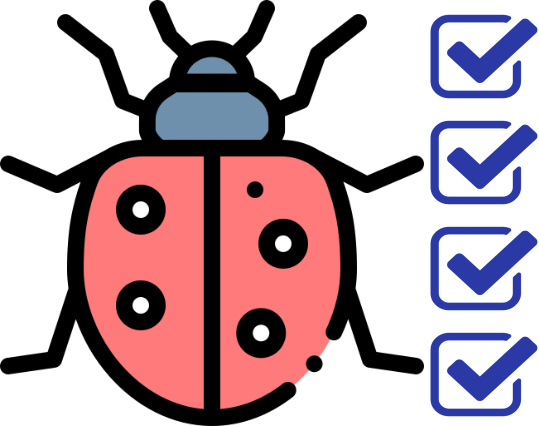
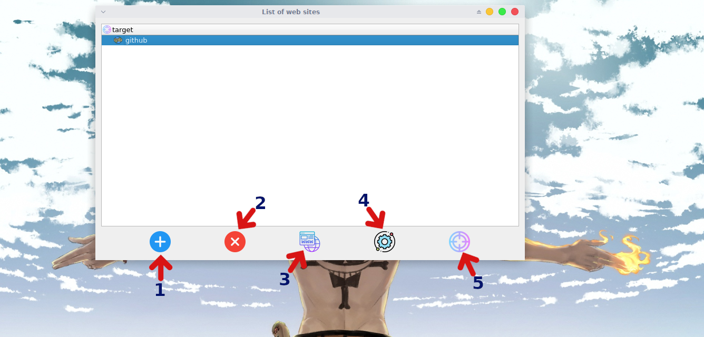

# bugbounty_checklist

<br>
This tool may help you to have a good methodology for bug bounty hunting
this tool based on [Bug Bounty Checklist for Web App](https://github.com/sehno/Bug-bounty/blob/master/bugbounty_checklist.md#Single_domain) <br>
This tool is organized and allows you to deal with a wide range of domains and subdomain <br>
You can now add your methodology or use your friend methodology just by copying or creating the methodology file in `./methodologys` 
<br><br>
## requirement 

* [PyQt5](https://pypi.org/project/PyQt5/) : 
   * `pip3 install PyQt5`
* [python3](https://www.python.org/downloads/) 
* [sqlite3](https://docs.python.org/2/library/sqlite3.html) 


## demo 
[](https://www.youtube.com/watch?v=fc5h5Lg24g8)

## methodology file santax 
```
#syntax of the confige file 
#tab_name:<title>Title_text 
#tab_name:task_text
#note evry task under a title will belong to that title 
#example of title --> Recon:<title>Information Gathering 
#example of task--> Recon:enumerate subdomain with subfinder
#Always try to arrange tasks in "taps" from largest to smallest in terms of number of tasks

```

## usage 

This tool is Easy to handle , i made a shortcuts to be more faster 




- **1** : 
  - Add domain
  - `Ctrl+A`
- **2** : 
  - Delete
  - `Del`
- **3** :
  - Add subdomain 
  - `Ctrl+Alt+A`
- **4** :
  - Edite
  - `Ctrl+M`
- **5** :
  - Open check list of current domain 
  - `Ctrl+E`
- **Save the changes** :
  - `Ctrl+S`
- **Cancel** : 
  - `Ech`

## Some notes

if you want to use the white theme mode just set the value of `Activ_white_mode` to `True` <br>
this tool doesn't support multiple of windows yet
