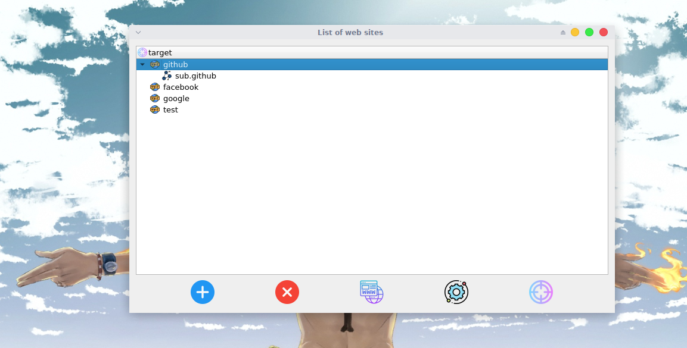
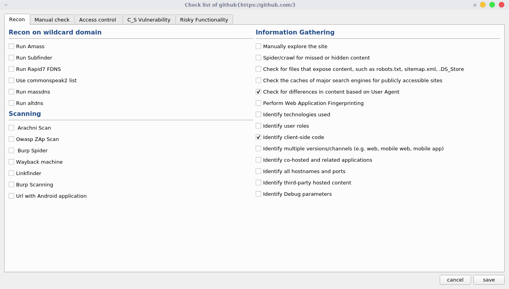

# bugbounty_checklist

 
This tool may help you to have a good methodology for bug bounty hunting
this tool based on Bug [Bounty Checklist for Web App](https://github.com/sehno/Bug-bounty/blob/master/bugbounty_checklist.md#Single_domain)  
This tool is organized and allows you to deal with a wide range of domains and subdomain

  
## requirement 

* [PyQt5](https://pypi.org/project/PyQt5/) : 
   * `pip3 install PyQt5`
* [python3](https://www.python.org/downloads/) 
* [sqlite3](https://docs.python.org/2/library/sqlite3.html) 

## demo 

* main window 
 
* check list interface 

## usage 

This tool is Easy to handle , i made a shortcuts to be more faster 

- **1** : 
  - Add domain
  - `Ctrl+A`
- **2** : 
  - Delete
  - `Del`
- **3** :
  - add subdomain 
  - `Ctrl+Alt+A`
- **4** :
  - Edite
  - `Ctrl+M`
- **5** :
  - Open check list of current domain 
  - `Ctrl+E`
